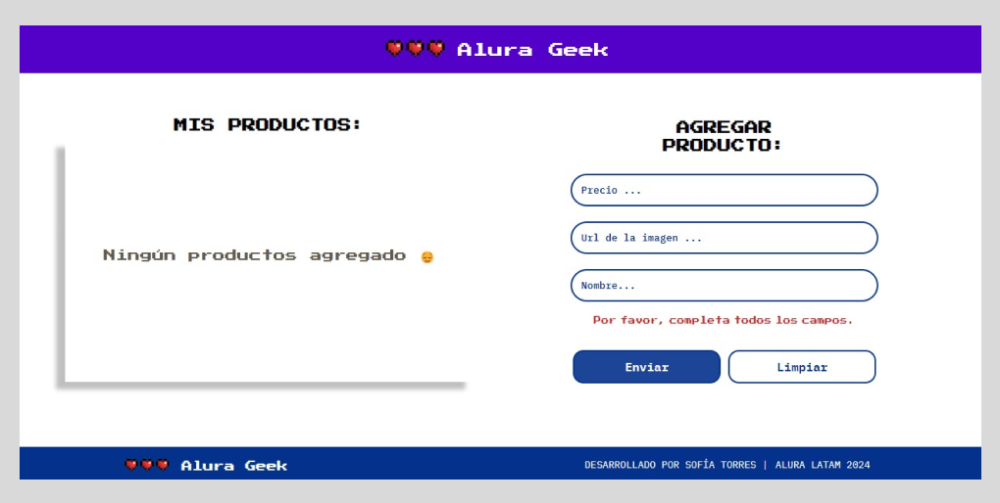
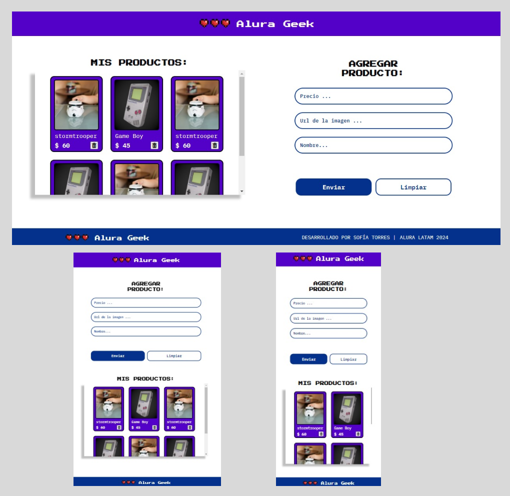

# Desafío Alura Geek

¡Hola! Bienvenido(a) al desafío de Alura Geek.
En este proyecto, he creado una aplicación web llamada Alura Geek, donde podrás agregar y visualizar productos geek. La aplicación se divide en dos partes principales:

1. **Formulario de Productos**: En la parte superior de la aplicación, encontrarás un formulario donde podrás agregar nuevos productos. El formulario incluye campos para el nombre del producto, el precio y la URL de la imagen. También hay botones para enviar el formulario y limpiar los campos.

2. **Listado de Productos**: En la parte inferior de la aplicación, se renderizan todos los productos agregados. Cada producto se muestra en una tarjeta que incluye su nombre, precio y una imagen. También tienes la opción de eliminar los productos individualmente.

## Modelo en Figma

Para una guía visual sobre el diseño de la aplicación, te presento el modelo en Figma. Puedes acceder a él aquí [aquí](https://www.figma.com/file/eSIemWMmHT750XP4D810yz/AluraGeek---new?type=design&node-id=0-1&mode=design&t=sPzLZwpKx6pJr0Jj-0).

## Cómo Ejecutar el Proyecto

Para ejecutar el proyecto localmente, sigue estos pasos:

1. Clona este repositorio en tu máquina local utilizando Git:
git clone https://github.com/tu_usuario/alura-geek.git
   
2. Instala las dependencias del proyecto utilizando el comando `npm install`.

3. Para iniciar el servidor JSON más rápido, puedes usar el siguiente comando `npm install`:

Este comando ejecutará el servidor JSON utilizando el script definido en el archivo `package.json`.

4. Abre el archivo `index.html` en tu navegador web.

## Capturas de Pantalla

Aquí tienes algunas capturas de pantalla de la aplicación:

1. **Mensajes Descriptivos para Guiar al Usuario**:

     

2. **Listado de Productos en Pantallas Responsivas**:
   
   

## Contribuciones Futuras

¡Gracias por explorar nuestro proyecto! Si te sientes inspirado(a) para contribuir o mejorar esta aplicación, ¡te damos la bienvenida a hacerlo! 

